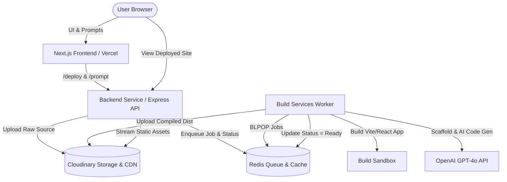

# Rwaft 🚀

An autonomous web deployment and AI application generation platform. **Rwaft** lets you turn public Git repositories or natural language prompts into live, production-hosted web applications in seconds.

---

## 🌟 Highlights

- **🐙 Git Repository Deployments**: Paste a public React/Vite/CRA repository URL to automatically clone, build, bundle, and deploy to the cloud.
- **✨ AI Application Generation**: Describe an app idea in plain English. The AI agent scaffolds a Vite + React + TypeScript application, writes and refines multi-file code, resolves TypeScript/build diagnostics automatically, and deploys it live.
- **⚡ Serverless-Ready Architecture**: Built-in asset hosting via Cloudinary CDN, queue orchestration via Redis, and automatic subdomain/wildcard reverse proxy routing.
- **🐳 Dual-Service Docker Container**: Production Docker image running both the backend API and build worker concurrently with signal handling and process supervision.
- **▲ Vercel-Ready Frontend**: Next.js App Router UI designed for instant deployment to Vercel with automatic API proxy rewrites.

---

## 🏗️ Architecture



---

## 📁 Repository Structure

```
rwaft/
├── backend-services/        # Express API: Handles Git clones, request routing & asset proxying
│   ├── lib/                 # Cloudinary, Redis, CORS, and upload utilities
│   ├── index.ts             # API entry point & asset reverse proxy
│   └── package.json
├── build-services/          # Background worker: Scaffolding, AI tool calls & builds
│   ├── lib/                 # AI engine, tool execution sandbox, Cloudinary uploaders
│   ├── index.ts             # Redis queue workers (deploy & prompt)
│   └── package.json
├── frontend/                # Next.js 16 + Tailwind CSS deployment console
│   ├── app/                 # App Router UI & styling
│   ├── next.config.ts       # Backend proxy rewrites
│   └── package.json
├── .github/workflows/       # GitHub Actions CI/CD for Docker Hub builds
├── Dockerfile               # Production multi-service container (Bun + Node + Git)
└── .dockerignore
```

---

## ⚙️ Environment Variables

### Backend & Build Worker (`backend-services` / `build-services`)

| Variable | Required | Description | Default |
| :--- | :---: | :--- | :--- |
| `PORT` | No | Port for backend API server | `3000` |
| `REDIS_URL` | **Yes** | Redis connection URI (e.g. Upstash or local) | `redis://localhost:6379` |
| `CLOUDINARY_CLOUD_NAME`| **Yes** | Cloudinary cloud identifier | — |
| `CLOUDINARY_API_KEY` | **Yes** | Cloudinary API Key | — |
| `CLOUDINARY_API_SECRET`| **Yes** | Cloudinary API Secret | — |
| `CLOUDINARY_UPLOAD_PRESET` | No | Optional Cloudinary unsigned upload preset | — |
| `OPENAI_API_KEY` | **Yes** | OpenAI API key for AI prompt deployments | — |
| `DEPLOYMENT_DOMAIN` | No | Base domain for deployed sites | `localhost:3000` |
| `FRONTEND_ORIGIN` | No | Allowed CORS origin(s), comma-separated or `*` | `http://localhost:3001` |
| `COMMAND_TIMEOUT_MS` | No | Timeout for individual build commands (ms) | `60000` |
| `JOB_TIMEOUT_MS` | No | Timeout for complete build jobs (ms) | `600000` |

### Frontend (`frontend`)

| Variable | Required | Description | Default |
| :--- | :---: | :--- | :--- |
| `BACKEND_URL` | **Yes** (Prod) | Public URL of the deployed backend service | `http://localhost:3000` |

---

## 🚀 Getting Started (Local Development)

### Prerequisites

- [Bun](https://bun.sh) (v1.1+) or [Node.js](https://nodejs.org) (v20+)
- [Git](https://git-scm.com)
- [Redis](https://redis.io) (Local or [Upstash](https://upstash.com))
- [Cloudinary Account](https://cloudinary.com)
- [OpenAI API Key](https://platform.openai.com)

---

### 1. Start Redis
```bash
# Using Docker
docker run -d -p 6379:6379 --name rwaft-redis redis:alpine
```

### 2. Start Backend Service
```bash
cd backend-services
bun install
bun run index.ts
```

### 3. Start Build Worker
```bash
cd build-services
bun install
bun run index.ts
```

### 4. Start Frontend Console
```bash
cd frontend
npm install
npm run dev -- -p 3001
```

Open [http://localhost:3001](http://localhost:3001) in your browser.

---

## 🐳 Docker Deployment

A single production Dockerfile runs both `backend-services` and `build-services` concurrently with full Node.js, npm, and Git runtime support:

```bash
# Build Docker image
docker build -t rwaft-services .

# Run container with environment variables
docker run -d -p 3000:3000 \
  -e PORT=3000 \
  -e REDIS_URL="redis://your-redis-host:6379" \
  -e CLOUDINARY_CLOUD_NAME="your_cloud_name" \
  -e CLOUDINARY_API_KEY="your_api_key" \
  -e CLOUDINARY_API_SECRET="your_api_secret" \
  -e OPENAI_API_KEY="sk-..." \
  -e DEPLOYMENT_DOMAIN="yourdomain.com" \
  -e FRONTEND_ORIGIN="https://your-frontend.vercel.app" \
  rwaft-services
```

---

## ▲ Deploying Frontend to Vercel

1. **Import the repository** into Vercel.
2. In the deployment configuration:
   - **Root Directory**: Select `frontend`
   - **Framework Preset**: `Next.js`
3. In **Environment Variables**, add:
   - `BACKEND_URL`: URL of your deployed backend service (e.g. `https://api.yourdomain.com` or your Docker hosting URL).
4. Click **Deploy**.

---

## 🤖 How AI Prompt Generation Works

1. **Scaffold**: The worker provisions a fresh Vite + React + TypeScript environment.
2. **Autonomous Tooling**: The OpenAI model generates iterative tool operations (create files, patch specific code chunks, execute terminal commands, inspect files).
3. **Automated Error Self-Healing**: If TypeScript checks or Vite builds fail, the error diagnostics are fed back into the AI model to perform multi-file repairs (up to 6 attempts) until the build passes.
4. **Cloud Distribution**: The compiled `dist` directory is uploaded to Cloudinary CDN and made instantly available at a custom URL.

---

## 🛡️ License

MIT
