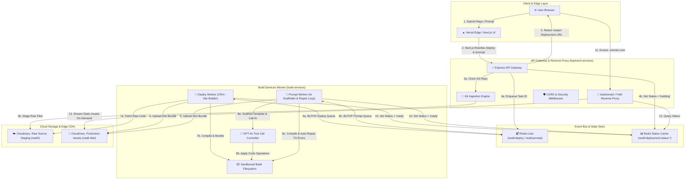
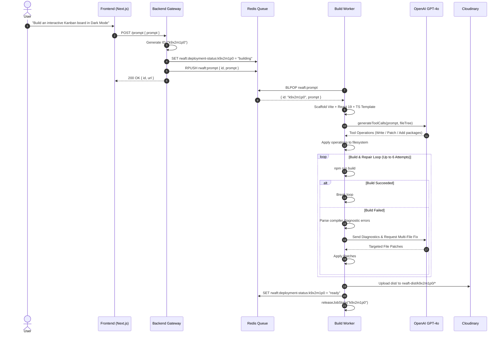
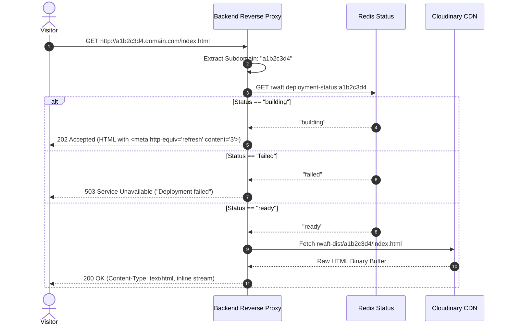

# Rwaft 🚀
### Autonomous Distributed Web Deployment & AI Application Generation Platform

[](#-system-architecture)
[](https://bun.sh)
[](https://redis.io)
[](https://cloudinary.com)
[](https://openai.com)
[-black.svg)](https://nextjs.org)

**Rwaft** is an end-to-end cloud platform and build orchestration system designed to deploy production web applications from two distinct sources:
1. **Public Git Repositories** (React, Vite, Create React App).
2. **Natural Language Prompts** via an autonomous, multi-turn AI coding engine featuring a closed-loop build verification and repair cycle.

The platform is engineered around an **event-driven, queue-based microservices architecture** that decouples frontend user interactions, API ingress, worker sandboxes, and CDN asset delivery.

---

## 📑 Table of Contents

1. [High-Level System Design](#-high-level-system-design)
2. [Detailed Component Architecture](#-detailed-component-architecture)
   - [1. Frontend Layer (Edge Ingress & UI)](#1-frontend-layer-edge-ingress--ui)
   - [2. Backend API Gateway & Dynamic Reverse Proxy](#2-backend-api-gateway--dynamic-reverse-proxy)
   - [3. Redis Asynchronous Message Bus](#3-redis-asynchronous-message-bus)
   - [4. Distributed Build & Compilation Worker](#4-distributed-build--compilation-worker)
   - [5. Autonomous AI Engine with Self-Healing Build Loop](#5-autonomous-ai-engine-with-self-healing-build-loop)
   - [6. Two-Tier Cloud Storage & Asset Distribution](#6-two-tier-cloud-storage--asset-distribution)
3. [Deep-Dive Sequence Diagrams](#-deep-dive-sequence-diagrams)
   - [A. Git Deployment Flow](#a-git-deployment-lifecycle)
   - [B. Prompt-Driven AI Self-Healing Flow](#b-prompt-driven-ai-generation--repair-lifecycle)
   - [C. Edge Asset Serving & Dynamic Resolution](#c-edge-asset-serving--dynamic-resolution)
4. [System Resilience & Fault Tolerance](#-system-resilience--fault-tolerance)
5. [Engineering Decision Log (Trade-offs & Rationale)](#-engineering-decision-log)
6. [Repository & Directory Structure](#-repository--directory-structure)
7. [Environment Variables Reference](#-environment-variables-reference)
8. [Local Development & Quickstart](#-local-development--quickstart)
9. [Production Deployment Guide (Docker & Vercel)](#-production-deployment-guide)

---

## 🏛️ High-Level System Design

The system separates high-frequency user I/O from long-running, CPU-intensive build tasks. Rather than tying up HTTP connections during multi-minute compiles, Rwaft uses an asynchronous worker pattern with atomic state management.



---

## 🔍 Detailed Component Architecture

### 1. Frontend Layer (Edge Ingress & UI)
- **Framework**: Next.js 16 with React 19 and Tailwind CSS v4.
- **Role**: Provides a developer-centric console for configuring Git repos or entering natural language application specifications.
- **Edge Rewrites**: Implements dynamic proxy rewrites inside `next.config.ts` so all frontend requests to `/deploy` and `/prompt` are mapped directly to the backend service, eliminating browser-side CORS preflight overhead in production while keeping API keys hidden.
- **State Polling & Instant Feedback**: Automatically parses the generated deployment URL and displays real-time building state indicators.

### 2. Backend API Gateway & Dynamic Reverse Proxy
- **Framework**: Express on Bun/Node runtime.
- **Endpoints**:
  - `POST /deploy`: Ingests repository URLs, performs shallow clone using `simple-git`, batches raw files into Cloudinary staging storage, registers the deployment ID in Redis, pushes to the queue, and returns an immediate response `<id>.<domain>/`.
  - `POST /prompt`: Generates a unique deployment ID, pushes the prompt payload directly to `rwaft:prompt`, and sets status to `building`.
  - `GET /{*splat}` (Wildcard Reverse Proxy):
    - **Subdomain Extraction**: Resolves target deployment ID either from subdomains (`<id>.domain.com`) or fallback path params (`domain.com/<id>/index.html`).
    - **Live State Polling**: If the build is still in progress (`building`), renders a lightweight HTML page with an automatic `<meta http-equiv="refresh" content="3">` tag. If `failed`, returns clean error messaging.
    - **Dynamic Asset Streaming**: Fetches compiled HTML, CSS, JS, SVG, and image assets on-demand from Cloudinary CDN (`rwaft-dist/<id>/...`) and pipes them with proper MIME types and `Content-Disposition: inline`.

### 3. Redis Asynchronous Message Bus
- **Engine**: Redis with atomic list operations (`rPush`, `blPop`) and key expiration (`SET ... EX 3600`).
- **Queues**:
  - `rwaft:deploy`: Ingests IDs of Git projects ready for compilation.
  - `rwaft:prompt`: Ingests `{ id, prompt }` payloads for AI generation.
- **Atomic Status Registry**: Keys under `rwaft:deployment-status:<id>` (`building` | `ready` | `failed`) with a 1-hour TTL, enabling zero-database instantaneous state lookups.

### 4. Distributed Build & Compilation Worker
- **Lifecycle Management**:
  - Runs continuous polling loops via `blPop` with automated exponential backoff recovery.
  - **Sandboxing & Isolation**: Each job operates in an isolated temporary directory `builds/<id>`.
  - **Process Management**: Monitors spawned child processes with hard command timeouts (`COMMAND_TIMEOUT_MS`) and overall job timeouts (`JOB_TIMEOUT_MS`).
  - **Resource Reclamation (`releaseJobState`)**: Automatically sweeps and terminates orphan processes, cleans up environment overlays, and deletes build artifacts upon job completion or failure.
- **Framework-Specific Build Adapters**:
  - **Vite**: Seamless modern bundling with TypeScript compilation.
  - **Create React App (CRA)**: Automatic webpack patching to disable Jest-worker parallel Terser minification (preventing node 20+ thread worker crashes), disabling ESLint build blockers, and suppressing source-map overhead.

### 5. Autonomous AI Engine with Self-Healing Build Loop
The AI worker is not a simple one-shot template generator; it is an **agentic iterative builder**:
1. **Scaffolding**: Clones a clean Vite + React + TypeScript base template, resets unnecessary starter code, and injects modern React 19 dependencies.
2. **Tool-Assisted Execution (`generateToolCalls`)**:
   - Model receives custom tool declarations (`search_files`, `read_file`, `write_file`, `patch_file`, `run_command`, `finish`).
   - Generates precise multi-file code modifications across components, styles, utilities, and assets.
3. **Closed-Loop Error Diagnosis & Automated Repair**:
   - Executes `npm run build` inside the sandbox.
   - If the compiler fails (TypeScript type mismatches, missing imports, unresolved packages, invalid JSX), the worker captures stderr and stdout diagnostics.
   - **Diagnostic Classifier**: Analyzes whether the error is TypeScript contract misalignment, module export drift, package resolution failure, or Vite asset syntax.
   - Feeds the structured diagnostics back into OpenAI for iterative targeted patching (up to **6 automated repair iterations**).
   - Once the build passes with exit code `0`, proceeds to deployment.

```
       ┌───────────────────────────────┐
       │   1. Scaffold Base Project    │
       └───────────────┬───────────────┘
                       │
       ┌───────────────▼───────────────┐
       │  2. AI Generates Multi-File   │◄────────────────┐
       │      Code Modifications       │                 │
       └───────────────┬───────────────┘                 │
                       │                                 │
       ┌───────────────▼───────────────┐                 │
       │    3. Apply File Patches      │                 │
       └───────────────┬───────────────┘                 │
                       │                                 │
       ┌───────────────▼───────────────┐                 │
       │  4. Execute `npm run build`   │                 │
       └───────────────┬───────────────┘                 │
                       │                                 │
              [Build Successful?]                        │
             /                   \                       │
          (Yes)                 (No)                     │
           /                       \                     │
┌─────────▼───────────┐   ┌─────────▼─────────────────┐  │
│ 5. Upload to CDN &  │   │ 5b. Classify Diagnostics  ├──┘
│    Mark 'ready'     │   │  & Feedback to AI (Max 6x)│
└─────────────────────┘   └───────────────────────────┘
```

### 6. Two-Tier Cloud Storage & Asset Distribution
- **Tier 1 — Source Staging (`rwaft/<id>/`)**: Raw source files are uploaded from Git clones in concurrent chunks (`UPLOAD_BATCH_SIZE = 10`) to Cloudinary raw storage, allowing worker nodes to fetch sources independently of API servers.
- **Tier 2 — Compiled CDN Distribution (`rwaft-dist/<id>/`)**: The built production output (`dist/` or `build/`) is scanned recursively and uploaded with concurrent batching (`UPLOAD_BATCH_SIZE = 8`), ready for edge proxying.

---

## 🔄 Deep-Dive Sequence Diagrams

### A. Git Deployment Lifecycle


### B. Prompt-Driven AI Generation & Repair Lifecycle



### C. Edge Asset Serving & Dynamic Resolution



---

## 🛡️ System Resilience & Fault Tolerance

| Threat / Failure Mode | Architectural Mitigation |
| :--- | :--- |
| **Worker Process Crash** | Workers are wrapped in `runWorkerForever` with exponential backoff (2s → 30s) ensuring automatic loop recovery without restarting the container. |
| **Infinite Build Loops / Deadlocks** | Command executions enforce `COMMAND_TIMEOUT_MS` (60s default). Entire jobs enforce `JOB_TIMEOUT_MS` (10m default) managed via `AbortController` and `Promise.race`. |
| **Memory / Zombie Process Leaks** | `releaseJobState` explicitly tracks and kills child processes associated with each project directory upon termination and clears per-job environment overlays. |
| **Path Traversal Attacks** | The AI sandbox enforces `safePath()` boundary checks, throwing strict exceptions if any tool tries to read or write files outside `builds/<id>`. |
| **Terser Minification Thread Crashes** | Automated regex patcher (`disableCraParallelMinification`) rewrites Webpack configurations inside CRA `node_modules` before builds run. |
| **TypeScript / Build Errors in AI Prompts** | Closed-loop heuristic classifier feeds compiler error stacks back into GPT-4o, repairing syntax and type discrepancies across up to 6 iterations. |
| **Graceful Container Termination** | Supervisor script traps `SIGTERM`/`SIGINT`, propagating signals to all child services (`backend-services` and `build-services`) before exiting. |

---

## 💡 Engineering Decision Log

### Why Bun + Node.js Dual Runtime?
- **Bun**: Used as the primary runtime for both backend and worker services because of its native TypeScript execution (no transpilation step or ts-node overhead), instant startup times, and high-throughput HTTP handling.
- **Node.js + npm**: Kept in the container environment because external React repositories, Create React App scripts, and Vite builds require standard Node.js APIs and npm ecosystem compatibility.

### Why Redis Queues instead of HTTP Webhooks?
Direct HTTP worker invocation suffers from timeout vulnerabilities during long installs. Redis `blPop` creates a **pull-based worker architecture** where workers consume tasks at their own capacity. If traffic spikes, jobs queue cleanly in Redis without dropping connections or overloading CPU.

### Why Cloudinary for Static Artifact Storage?
Cloudinary acts as both an object store and an edge CDN. Storing compiled assets under `rwaft-dist/<id>/` allows the reverse proxy to stream files dynamically with automatic gzip/brotli compression and global edge caching without maintaining dedicated S3/GCS buckets.

---

## 📂 Repository & Directory Structure

```
rwaft/
├── backend-services/                 # Express API Gateway & Reverse Proxy
│   ├── lib/
│   │   ├── cloudinary.ts             # Cloudinary SDK client & asset URL resolution
│   │   ├── middleware.ts             # CORS middleware supporting multi-origin/wildcards
│   │   ├── redis.ts                  # Redis singleton connection pool
│   │   ├── upload.ts                 # Batched asset uploader
│   │   └── utils.ts                  # ID generation & filesystem traversal helpers
│   ├── index.ts                      # API routes (/deploy, /prompt) & wildcard asset proxy
│   └── package.json
│
├── build-services/                   # Asynchronous Build & AI Generation Worker
│   ├── lib/
│   │   ├── ai.ts                     # OpenAI GPT-4o tool declarations & response parser
│   │   ├── config.ts                 # Redis & Cloudinary worker configurations
│   │   ├── helper.ts                 # Directory recursive file crawler
│   │   ├── tools.ts                  # Sandbox file operations, safePath, & process tracker
│   │   └── upload.ts                 # Cloudinary chunked distribution uploader
│   ├── index.ts                      # Redis deploy & prompt workers with AI auto-repair loop
│   └── package.json
│
├── frontend/                         # Next.js 16 Web Console
│   ├── app/
│   │   ├── layout.tsx                # Root layout & font definitions
│   │   ├── page.tsx                  # Interactive deployment console UI
│   │   └── globals.css               # Design system & dark mode styles
│   ├── next.config.ts                # Backend proxy rewrites configuration
│   └── package.json
│
├── .github/workflows/
│   └── docker-publish.yml            # CI/CD: Automated multi-arch Docker image build & push
├── Dockerfile                        # Production supervisor container (Bun + Node + Git)
├── .dockerignore                     # Build context exclusions
└── README.md                         # System documentation
```

---

## ⚙️ Environment Variables Reference

### Backend & Build Worker (`backend-services` / `build-services`)

| Variable | Type | Required | Description | Default |
| :--- | :---: | :---: | :--- | :--- |
| `PORT` | `number` | No | Ingress HTTP port for Express gateway | `3000` |
| `REDIS_URL` | `string` | **Yes** | Redis connection URI (Local or Upstash) | `redis://localhost:6379` |
| `CLOUDINARY_CLOUD_NAME` | `string` | **Yes** | Cloudinary account name | — |
| `CLOUDINARY_API_KEY` | `string` | **Yes** | Cloudinary API Key | — |
| `CLOUDINARY_API_SECRET` | `string` | **Yes** | Cloudinary API Secret | — |
| `CLOUDINARY_UPLOAD_PRESET`| `string` | No | Optional unsigned upload preset | — |
| `OPENAI_API_KEY` | `string` | **Yes** | OpenAI API key for AI generation | — |
| `DEPLOYMENT_DOMAIN` | `string` | No | Root domain for generated deployment URLs | `localhost:3000` |
| `FRONTEND_ORIGIN` | `string` | No | Allowed CORS origin(s), comma-separated or `*` | `http://localhost:3001` |
| `COMMAND_TIMEOUT_MS` | `number` | No | Maximum execution time per terminal command | `60000` (1 min) |
| `JOB_TIMEOUT_MS` | `number` | No | Hard timeout per complete deployment job | `600000` (10 min) |

### Frontend (`frontend`)

| Variable | Type | Required | Description | Default |
| :--- | :---: | :---: | :--- | :--- |
| `BACKEND_URL` | `string` | **Yes** (Prod) | URL of the deployed backend service | `http://localhost:3000` |

---

## 🚀 Local Development & Quickstart

### Prerequisites
- **[Bun](https://bun.sh)** (v1.1+) or **[Node.js](https://nodejs.org)** (v20+)
- **[Git](https://git-scm.com)**
- **[Redis](https://redis.io)** running locally or on Upstash
- **Cloudinary** and **OpenAI** API keys

### Step 1: Clone Repository
```bash
git clone https://github.com/nios-x/rwaft.git
cd rwaft
```

### Step 2: Start Redis
```bash
docker run -d -p 6379:6379 --name rwaft-redis redis:alpine
```

### Step 3: Configure Environment Variables
Create `.env` inside `backend-services/` and `build-services/`:
```env
REDIS_URL="redis://localhost:6379"
CLOUDINARY_CLOUD_NAME="your_cloud_name"
CLOUDINARY_API_KEY="your_api_key"
CLOUDINARY_API_SECRET="your_api_secret"
OPENAI_API_KEY="sk-..."
DEPLOYMENT_DOMAIN="localhost:3000"
FRONTEND_ORIGIN="http://localhost:3001"
```

### Step 4: Run Services Concurrently

**Terminal 1 (Backend API Gateway):**
```bash
cd backend-services
bun install
bun run index.ts
```

**Terminal 2 (Build & AI Worker):**
```bash
cd build-services
bun install
bun run index.ts
```

**Terminal 3 (Frontend Console):**
```bash
cd frontend
npm install
npm run dev -- -p 3001
```

Visit **[http://localhost:3001](http://localhost:3001)** to start deploying!

---

## 🚢 Production Deployment Guide

### Option 1: Docker (Unified Backend + Worker Container)

The included [Dockerfile](file:///c:/Users/HP/Desktop/rwaft/Dockerfile) packages `backend-services` and `build-services` into a single, production-hardened container managed by a supervisor script.

```bash
# 1. Build the Docker image
docker build -t rwaft-services .

# 2. Run the container with your secrets
docker run -d -p 3000:3000 \
  -e PORT=3000 \
  -e REDIS_URL="redis://your-redis-server:6379" \
  -e CLOUDINARY_CLOUD_NAME="your_cloud_name" \
  -e CLOUDINARY_API_KEY="your_api_key" \
  -e CLOUDINARY_API_SECRET="your_api_secret" \
  -e OPENAI_API_KEY="sk-your-openai-key" \
  -e DEPLOYMENT_DOMAIN="yourdomain.com" \
  -e FRONTEND_ORIGIN="https://your-app.vercel.app" \
  rwaft-services
```

### Option 2: Frontend on Vercel

1. Push your repository to GitHub.
2. In the **Vercel Dashboard**, click **Add New Project** and import `rwaft`.
3. Configure settings:
   - **Root Directory**: `frontend`
   - **Framework Preset**: `Next.js`
4. In **Environment Variables**, add:
   - `BACKEND_URL`: `https://your-deployed-backend-url.com`
5. Click **Deploy**. Vercel will build and serve the frontend while automatically proxying API calls.

---

## 📜 License

Distributed under the **MIT License**. See `LICENSE` for more information.
