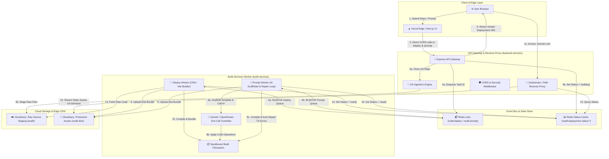
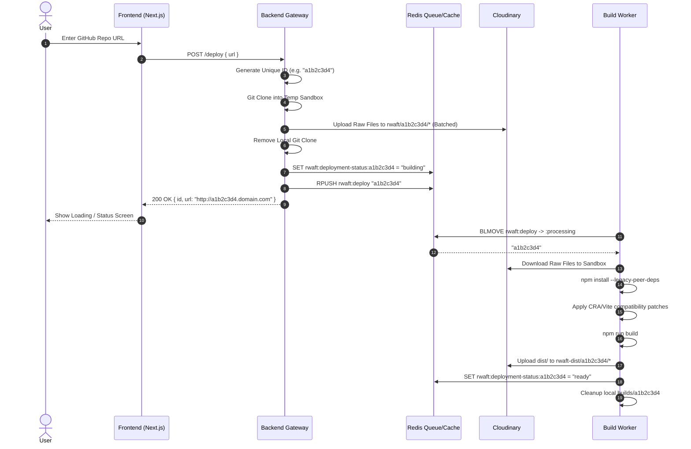
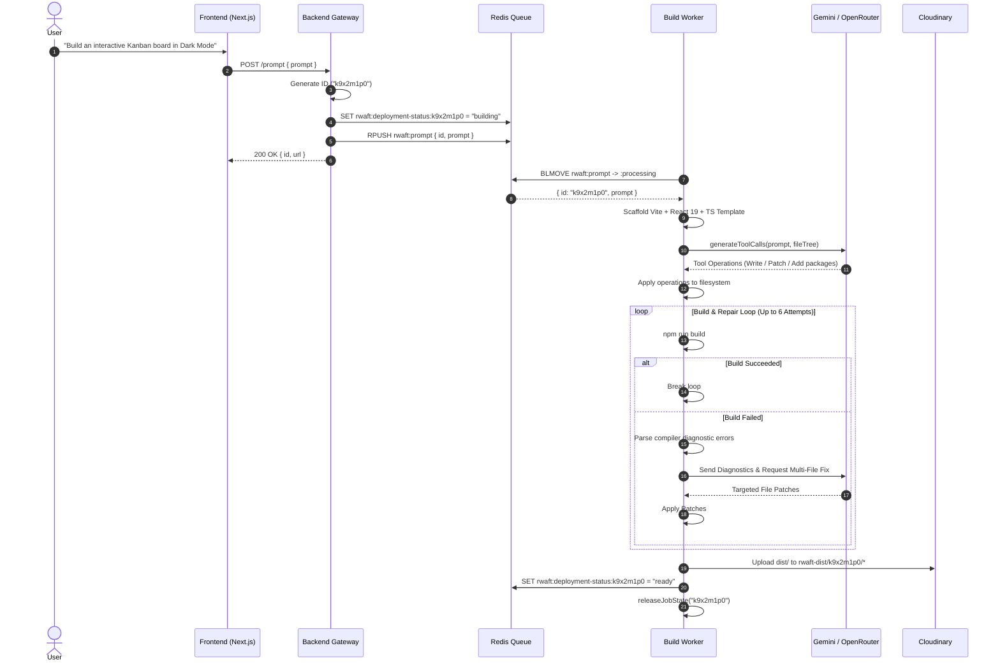
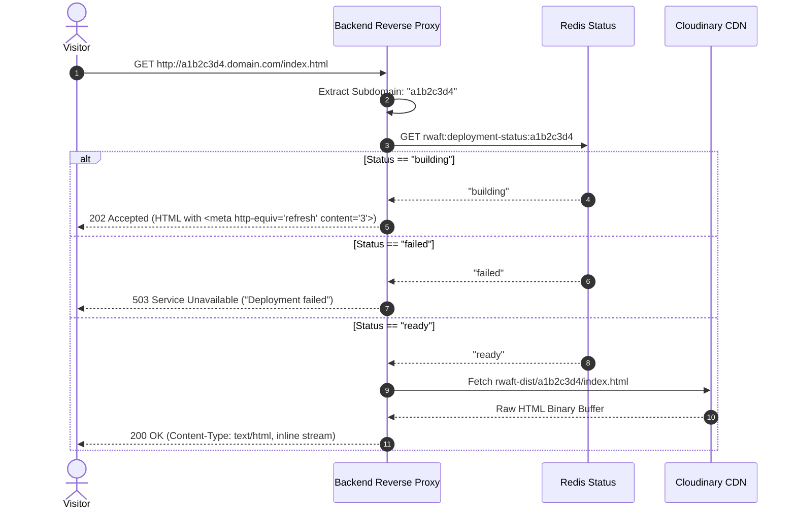

<div align="center">

# 🚀 Rwaft

**Autonomous Distributed Web Deployment & AI Application Generation Platform**

[](#-system-architecture)
[](https://bun.sh)
[](https://redis.io)
[](https://cloudinary.com)
[](https://ai.google.dev)
[-black.svg)](https://nextjs.org)

</div>

**Rwaft** is an end-to-end cloud platform and build orchestration system designed to deploy production web applications from two distinct sources:
1. **Public Git Repositories** (React, Vite, Create React App).
2. **Natural Language Prompts** via an autonomous, multi-turn AI coding engine featuring a closed-loop build verification and repair cycle.

The platform is engineered around an **event-driven, queue-based microservices architecture** that decouples frontend user interactions, API ingress, worker sandboxes, and CDN asset delivery.

---

<?xml version="1.0" standalone="no"?>
<!DOCTYPE svg PUBLIC "-//W3C//DTD SVG 1.1//EN" "http://www.w3.org/Graphics/SVG/1.1/DTD/svg11.dtd">


## 📑 Table of Contents

1. [High-Level System Design](#-high-level-system-design)
2. [Detailed Component Architecture](#-detailed-component-architecture)
   - [1. Frontend Layer (Edge Ingress & UI)](#1-frontend-layer-edge-ingress--ui)
   - [2. Backend API Gateway & Dynamic Reverse Proxy](#2-backend-api-gateway--dynamic-reverse-proxy)
   - [3. Redis Asynchronous Message Bus](#3-redis-asynchronous-message-bus)
   - [4. Distributed Build & Compilation Worker](#4-distributed-build--compilation-worker)
   - [5. Autonomous AI Engine with Self-Healing Build Loop](#5-autonomous-ai-engine-with-self-healing-build-loop)
   - [6. Two-Tier Cloud Storage & Asset Distribution](#6-two-tier-cloud-storage--asset-distribution)
3. [Deep-Dive Sequence Diagrams](#-deep-dive-sequence-diagrams)
   - [A. Git Deployment Flow](#a-git-deployment-lifecycle)
   - [B. Prompt-Driven AI Self-Healing Flow](#b-prompt-driven-ai-generation--repair-lifecycle)
   - [C. Edge Asset Serving & Dynamic Resolution](#c-edge-asset-serving--dynamic-resolution)
4. [System Resilience & Fault Tolerance](#-system-resilience--fault-tolerance)
5. [Engineering Decision Log (Trade-offs & Rationale)](#-engineering-decision-log)
6. [Repository & Directory Structure](#-repository--directory-structure)
7. [Environment Variables Reference](#-environment-variables-reference)
8. [Live Build Logs (Redis Pub/Sub)](#-live-build-logs-redis-pubsub)
9. [Local Development & Quickstart](#-local-development--quickstart)
10. [Production Deployment Guide (Render, Docker & Vercel)](#-production-deployment-guide)

---

## 🏛️ High-Level System Design

The system separates high-frequency user I/O from long-running, CPU-intensive build tasks. Rather than tying up HTTP connections during multi-minute compiles, Rwaft uses an asynchronous worker pattern with atomic state management.



---

## 🔍 Detailed Component Architecture

### 1. Frontend Layer (Edge Ingress & UI)
- **Framework**: Next.js 16 with React 19 and Tailwind CSS v4.
- **Role**: Provides a developer-centric console for configuring Git repos or entering natural language application specifications.
- **Direct API calls**: The browser calls the API origin directly using `NEXT_PUBLIC_BACKEND_URL`, governed by the API's `FRONTEND_ORIGIN` CORS allowlist. Proxying through Next.js rewrites was removed because it risks the edge buffering the Server-Sent Events log stream. No secrets reach the browser either way — the frontend holds no credentials.
- **Live build log**: Subscribes to `GET /logs/:userId` over `EventSource` and renders worker output as it happens.
- **State Polling & Instant Feedback**: Automatically parses the generated deployment URL and displays real-time building state indicators.

### 2. Backend API Gateway & Dynamic Reverse Proxy
- **Framework**: Express on Bun/Node runtime.
- **Endpoints**:
  - `POST /deploy`: Ingests repository URLs, performs shallow clone using `simple-git`, batches raw files into Cloudinary staging storage, registers the deployment ID in Redis, pushes to the queue, and returns an immediate response `<id>.<domain>/`.
  - `POST /prompt`: Generates a unique deployment ID, pushes the prompt payload directly to `rwaft:prompt`, and sets status to `building`.
  - `GET /{*splat}` (Wildcard Reverse Proxy):
    - **Subdomain Extraction**: Resolves target deployment ID either from subdomains (`<id>.domain.com`) or fallback path params (`domain.com/<id>/index.html`).
    - **Live State Polling**: If the build is still in progress (`building`), renders a lightweight HTML page with an automatic `<meta http-equiv="refresh" content="3">` tag. If `failed`, returns clean error messaging.
    - **Dynamic Asset Streaming**: Fetches compiled HTML, CSS, JS, SVG, and image assets on-demand from Cloudinary CDN (`rwaft-dist/<id>/...`) and pipes them with proper MIME types and `Content-Disposition: inline`.

### 3. Redis Asynchronous Message Bus
- **Engine**: Redis with atomic list operations (`rPush`, `BLMOVE`) and key expiration. `BLMOVE` moves a claimed job onto a companion `:processing` list, so a worker that dies mid-build leaves the job recoverable instead of losing it; the entry is acknowledged with `lRem` only after the job settles, and orphans are requeued at worker startup.
- **Log bus**: `rwaft:logs:<userId>` pub/sub channel plus a capped history list — see [Live Build Logs](#-live-build-logs-redis-pubsub).
- **Queues**:
  - `rwaft:deploy`: Ingests IDs of Git projects ready for compilation.
  - `rwaft:prompt`: Ingests `{ id, prompt }` payloads for AI generation.
- **Atomic Status Registry**: Keys under `rwaft:deployment-status:<id>` (`queued` | `building` | `ready` | `failed`) with a 24-hour TTL (`STATUS_TTL_SECONDS`), enabling zero-database instantaneous state lookups.

### 4. Distributed Build & Compilation Worker
- **Lifecycle Management**:
  - Runs continuous polling loops via `BLMOVE` with automated exponential backoff recovery and a bounded block so shutdown stays responsive.
  - **Sandboxing & Isolation**: Each job operates in an isolated temporary directory `builds/<id>`.
  - **Process Management**: Monitors spawned child processes with hard command timeouts (`COMMAND_TIMEOUT_MS`) and overall job timeouts (`JOB_TIMEOUT_MS`).
  - **Resource Reclamation (`releaseJobState`)**: Automatically sweeps and terminates orphan processes, cleans up environment overlays, and deletes build artifacts upon job completion or failure.
- **Framework-Specific Build Adapters**:
  - **Vite**: Seamless modern bundling with TypeScript compilation.
  - **Create React App (CRA)**: Automatic webpack patching to disable Jest-worker parallel Terser minification (preventing node 20+ thread worker crashes), disabling ESLint build blockers, and suppressing source-map overhead.

### 5. Autonomous AI Engine with Self-Healing Build Loop
The AI worker is not a simple one-shot template generator; it is an **agentic iterative builder**:
1. **Scaffolding**: Clones a clean Vite + React + TypeScript base template, resets unnecessary starter code, and injects modern React 19 dependencies.
2. **Tool-Assisted Execution (`generateToolCalls`)**:
   - Model receives custom tool declarations (`search_files`, `read_file`, `write_file`, `patch_file`, `run_command`, `finish`).
   - Generates precise multi-file code modifications across components, styles, utilities, and assets.
3. **Closed-Loop Error Diagnosis & Automated Repair**:
   - Executes `npm run build` inside the sandbox.
   - If the compiler fails (TypeScript type mismatches, missing imports, unresolved packages, invalid JSX), the worker captures stderr and stdout diagnostics.
   - **Diagnostic Classifier**: Analyzes whether the error is TypeScript contract misalignment, module export drift, package resolution failure, or Vite asset syntax.
   - Feeds the structured diagnostics back into the AI provider for iterative targeted patching (up to **6 automated repair iterations**, `MAX_BUILD_REPAIRS`).
   - Once the build passes with exit code `0`, proceeds to deployment.

```
       ┌───────────────────────────────┐
       │   1. Scaffold Base Project    │
       └───────────────┬───────────────┘
                       │
       ┌───────────────▼───────────────┐
       │  2. AI Generates Multi-File   │◄────────────────┐
       │      Code Modifications       │                 │
       └───────────────┬───────────────┘                 │
                       │                                 │
       ┌───────────────▼───────────────┐                 │
       │    3. Apply File Patches      │                 │
       └───────────────┬───────────────┘                 │
                       │                                 │
       ┌───────────────▼───────────────┐                 │
       │  4. Execute `npm run build`   │                 │
       └───────────────┬───────────────┘                 │
                       │                                 │
              [Build Successful?]                        │
             /                   \                       │
          (Yes)                 (No)                     │
           /                       \                     │
┌─────────▼───────────┐   ┌─────────▼─────────────────┐  │
│ 5. Upload to CDN &  │   │ 5b. Classify Diagnostics  ├──┘
│    Mark 'ready'     │   │  & Feedback to AI (Max 6x)│
└─────────────────────┘   └───────────────────────────┘
```

### 6. Two-Tier Cloud Storage & Asset Distribution
- **Tier 1 — Source Staging (`rwaft/<id>/`)**: Raw source files are uploaded from Git clones in concurrent chunks (`UPLOAD_BATCH_SIZE = 10`) to Cloudinary raw storage, allowing worker nodes to fetch sources independently of API servers.
- **Tier 2 — Compiled CDN Distribution (`rwaft-dist/<id>/`)**: The built production output (`dist/` or `build/`) is scanned recursively and uploaded with concurrent batching (`UPLOAD_BATCH_SIZE = 8`), ready for edge proxying.

---

## 🔄 Deep-Dive Sequence Diagrams

### A. Git Deployment Lifecycle



### B. Prompt-Driven AI Generation & Repair Lifecycle



### C. Edge Asset Serving & Dynamic Resolution



---

## 🛡️ System Resilience & Fault Tolerance

| Threat / Failure Mode | Architectural Mitigation |
| :--- | :--- |
| **Worker Process Crash** | Workers are wrapped in `runWorkerForever` with exponential backoff (2s → 30s) ensuring automatic loop recovery without restarting the container. |
| **Infinite Build Loops / Deadlocks** | Command executions enforce `COMMAND_TIMEOUT_MS` (60s default). Entire jobs enforce `JOB_TIMEOUT_MS` (10m default) managed via `AbortController` and `Promise.race`. |
| **Memory / Zombie Process Leaks** | `releaseJobState` explicitly tracks and kills child processes associated with each project directory upon termination and clears per-job environment overlays. |
| **Path Traversal Attacks** | The AI sandbox enforces `safePath()` boundary checks, throwing strict exceptions if any tool tries to read or write files outside `builds/<id>`. |
| **Terser Minification Thread Crashes** | Automated regex patcher (`disableCraParallelMinification`) rewrites Webpack configurations inside CRA `node_modules` before builds run. |
| **TypeScript / Build Errors in AI Prompts** | Closed-loop heuristic classifier feeds compiler error stacks back into the AI provider, repairing syntax and type discrepancies across up to 6 iterations. |
| **Graceful Container Termination** | Each image runs `tini` as PID 1 so `SIGTERM` reaches the app. The API drains open connections; the worker finishes its current job, flushes logs, and leaves unfinished work on the `:processing` list for recovery. |

---

## 💡 Engineering Decision Log

### Why Bun + Node.js Dual Runtime?
- **Bun**: Used as the primary runtime for both backend and worker services because of its native TypeScript execution (no transpilation step or ts-node overhead), instant startup times, and high-throughput HTTP handling.
- **Node.js + npm**: Kept in the container environment because external React repositories, Create React App scripts, and Vite builds require standard Node.js APIs and npm ecosystem compatibility.

### Why Redis Queues instead of HTTP Webhooks?
Direct HTTP worker invocation suffers from timeout vulnerabilities during long installs. Redis `BLMOVE` creates a **pull-based worker architecture** where workers consume tasks at their own capacity. If traffic spikes, jobs queue cleanly in Redis without dropping connections or overloading CPU.

### Why Cloudinary for Static Artifact Storage?
Cloudinary acts as both an object store and an edge CDN. Storing compiled assets under `rwaft-dist/<id>/` allows the reverse proxy to stream files dynamically with automatic gzip/brotli compression and global edge caching without maintaining dedicated S3/GCS buckets.

---

## 📂 Repository & Directory Structure

```
rwaft/
├── backend-services/                 # Express API gateway & deployment proxy
│   ├── lib/
│   │   ├── cloudinary.ts             # Cloudinary client & asset URL resolution
│   │   ├── constants.ts              # Queue/key names shared with the worker
│   │   ├── logstream.ts              # Multiplexed Redis subscriber for per-user SSE
│   │   ├── middleware.ts             # CORS allowlist & security headers
│   │   ├── ratelimit.ts              # Redis-backed per-user/IP rate limiting
│   │   ├── redis.ts                  # Lazy, self-healing Redis connection
│   │   ├── upload.ts                 # Cloudinary uploader
│   │   └── utils.ts                  # CSPRNG ids, repo URL validation, file crawler
│   ├── index.ts                      # Routes: /deploy /prompt /logs /status /session + site proxy
│   └── package.json
│
├── build-services/                   # Asynchronous build & AI generation worker
│   ├── lib/
│   │   ├── ai.ts                     # Gemini/OpenRouter tool declarations & response parser
│   │   ├── config.ts                 # Redis & Cloudinary config, shared queue names
│   │   ├── helper.ts                 # Recursive file crawler
│   │   ├── joblog.ts                 # Per-user log pub/sub (AsyncLocalStorage job context)
│   │   ├── run.ts                    # Process-group-safe runner; install/build timeouts
│   │   ├── tools.ts                  # Sandboxed file operations & process tracking
│   │   └── upload.ts                 # Cloudinary distribution uploader
│   ├── index.ts                      # Reliable deploy/prompt queues with AI auto-repair loop
│   └── package.json
│
├── frontend/                         # Next.js web console
│   ├── app/
│   │   ├── layout.tsx                # Root layout & fonts
│   │   ├── page.tsx                  # Deployment console + live build log
│   │   └── globals.css               # Design system
│   ├── lib/
│   │   ├── config.ts                 # Backend origin resolution
│   │   ├── useBuildLogs.ts           # EventSource subscription & de-duplication
│   │   └── useUserId.ts              # Per-visitor id, issued once and persisted
│   ├── next.config.ts                # Security headers (API is called directly)
│   └── package.json
│
├── .github/workflows/
│   └── docker-publish.yml            # CI: builds and pushes both images
├── Dockerfile.api                    # API image (Bun + git, non-root)
├── Dockerfile.worker                 # Worker image (Bun + Node/npm + git, non-root)
├── render.yaml                       # Render blueprint: API + worker + Redis
├── vercel.json                       # Frontend deployment settings
├── .dockerignore                     # Build context exclusions
└── README.md                         # System documentation
```

---
## ⚙️ Environment Variables Reference

Copy the `.env.example` in each service directory and fill it in. Real `.env`
files are git-ignored and are excluded from Docker images.

### API (`backend-services`)

| Variable | Type | Required | Description | Default |
| :--- | :---: | :---: | :--- | :--- |
| `REDIS_URL` | `string` | **Yes** | Redis connection URI (local, Upstash, Render Key Value) | — |
| `CLOUDINARY_CLOUD_NAME` | `string` | **Yes** | Cloudinary account name | — |
| `CLOUDINARY_API_KEY` | `string` | **Yes**\* | Cloudinary API key (signed uploads) | — |
| `CLOUDINARY_API_SECRET` | `string` | **Yes**\* | Cloudinary API secret | — |
| `CLOUDINARY_UPLOAD_PRESET` | `string` | No | Unsigned-upload preset, \*used instead of key/secret | — |
| `FRONTEND_ORIGIN` | `string` | **Yes** (prod) | Comma-separated exact browser origins allowed to call this API. **No wildcard default in production** — unset means every browser request is blocked | dev localhost origins |
| `PUBLIC_BASE_URL` | `string` | **Yes** (prod) | Externally reachable URL of this service; deployment URLs are built from it | request host |
| `PORT` | `number` | No | HTTP port (the platform usually injects this) | `3000` |
| `DEPLOYMENT_DOMAIN` | `string` | No | Root domain for subdomain-style deployment URLs | — |
| `DEPLOYMENT_WILDCARD` | `bool` | No | Set `true` **only** with real wildcard DNS + wildcard TLS. Otherwise URLs stay path-based | `false` |
| `DEPLOY_RATE_LIMIT` | `number` | No | `/deploy` requests per user/IP per hour | `5` |
| `PROMPT_RATE_LIMIT` | `number` | No | `/prompt` requests per user/IP per hour | `3` |
| `ALLOWED_REPO_HOSTS` | `string` | No | Hosts `/deploy` may clone from; `*` allows any public host | `github.com,gitlab.com,bitbucket.org` |
| `MAX_PROMPT_CHARS` | `number` | No | Longest accepted prompt | `8000` |
| `JSON_BODY_LIMIT` | `string` | No | Max request body size | `64kb` |
| `STATUS_TTL_SECONDS` | `number` | No | How long deployment status is retained | `86400` |
| `SSE_HISTORY_LIMIT` | `number` | No | Log events replayed to a reconnecting browser | `300` |
| `TRUST_PROXY_HOPS` | `number` | No | Proxy hops to trust for client IP and protocol | `1` |

### Build worker (`build-services`)

| Variable | Type | Required | Description | Default |
| :--- | :---: | :---: | :--- | :--- |
| `REDIS_URL` | `string` | **Yes** | Same Redis instance as the API | — |
| `CLOUDINARY_*` | `string` | **Yes** | Same Cloudinary settings as the API | — |
| `GEMINI_API_KEY` | `string` | **Yes**† | Google Gemini key. `GEMINI_API_KEY1`…`9` add rotation across free-tier keys | — |
| `OPENROUTER_API_KEY` | `string` | **Yes**† | OpenRouter key. `OPENROUTER_API_KEY1`…`7` add rotation | — |
| `AI_MODEL` | `string` | No | Preferred Gemini model | `gemini-3.7-flash` |
| `OPENROUTER_MODEL` | `string` | No | Preferred OpenRouter model | `nvidia/nemotron-3.5-lightning:free` |
| `BUILD_ROOT` | `string` | No | Scratch space for user builds — keep this off the app directory | `<tmp>/rwaft-builds` |
| `INSTALL_TIMEOUT_MS` | `number` | No | Timeout for `npm install` | `600000` (10 min) |
| `BUILD_TIMEOUT_MS` | `number` | No | Timeout for `npm run build` | `600000` (10 min) |
| `COMMAND_TIMEOUT_MS` | `number` | No | Timeout for one-off commands the AI runs | `120000` (2 min) |
| `JOB_TIMEOUT_MS` | `number` | No | Hard ceiling for one complete job | `900000` (15 min) |
| `MAX_BUILD_REPAIRS` | `number` | No | AI repair attempts before a build is failed | `6` |
| `PORT` | `number` | No | Only set if the host requires an open port; enables a `/health` probe | unset |

† At least one AI provider key is required for the `/prompt` flow.

### Frontend (`frontend`)

| Variable | Type | Required | Description | Default |
| :--- | :---: | :---: | :--- | :--- |
| `NEXT_PUBLIC_BACKEND_URL` | `string` | **Yes** (prod) | Origin of the API. Inlined at build time, so it must be set **before** the production build runs. There is no hardcoded production fallback | dev `http://localhost:3000` |

---

## 📡 Live Build Logs (Redis Pub/Sub)

Build output streams from the worker to the browser in real time, isolated per
user.

```
worker jobLog()
      │  publish + capped history list
      ▼
Redis  rwaft:logs:<userId>           (pub/sub channel)
       rwaft:logs:<userId>:history   (last 500 events, 24h TTL)
      │  one shared subscriber, fanned out in-process
      ▼
API    GET /logs/:userId             (Server-Sent Events)
      ▼
Browser EventSource → live console
```

**How a user is identified.** On first visit the browser calls `GET /session`,
which returns a unique id (`u-` + 128 random bits). It is kept in
`localStorage`, sent with every `/deploy` and `/prompt` request, and carried
through the queue payload to the worker. The worker publishes only to that
user's channel, so one person's build output is never visible in another's
console.

**Design notes**

- **SSE, not WebSockets** — the traffic is one-way, it passes through ordinary
  HTTP proxies, and `EventSource` reconnects on its own.
- **History replay** — each connection replays recent events before following
  the live channel, so a refresh or a dropped connection mid-build resumes
  instead of showing an empty console. Duplicates are expected and the client
  de-dupes on the server-assigned `jobId:seq`.
- **One Redis subscriber per process** — Redis puts a connection into subscriber
  mode, so a connection per browser would exhaust a managed Redis plan's limit.
  The API multiplexes a single subscriber and unsubscribes when the last reader
  for a user disconnects.
- **Best-effort** — a log publish failure never fails a build.

| Endpoint | Purpose |
| :--- | :--- |
| `GET /session` | Issue a new user id |
| `GET /logs/:userId` | SSE stream of that user's build log |
| `DELETE /logs/:userId` | Clear that user's retained history |
| `GET /status/:id` | Poll a deployment's status (fallback when SSE is unavailable) |

---

## 🚀 Local Development & Quickstart

### Prerequisites
- **[Bun](https://bun.sh)** (v1.1+) — runs the API and worker
- **[Node.js](https://nodejs.org)** (v20+) and npm — the worker shells out to npm to build user projects
- **[Git](https://git-scm.com)**
- **[Redis](https://redis.io)** locally or on Upstash
- **Cloudinary** credentials, and a **Gemini** or **OpenRouter** key

### Step 1: Clone
```bash
git clone https://github.com/nios-x/rwaft.git
cd rwaft
```

### Step 2: Start Redis
```bash
docker run -d -p 6379:6379 --name rwaft-redis redis:alpine
```

### Step 3: Configure environment
```bash
cp backend-services/.env.example backend-services/.env
cp build-services/.env.example  build-services/.env
cp frontend/.env.example        frontend/.env.local
```
Then fill in the Cloudinary and AI keys.

### Step 4: Run the three services

**Terminal 1 — API:**
```bash
cd backend-services && bun install && bun run dev
```

**Terminal 2 — build worker:**
```bash
cd build-services && bun install && bun run dev
```

**Terminal 3 — frontend:**
```bash
cd frontend && npm install && npm run dev -- -p 3001
```

Visit **[http://localhost:3001](http://localhost:3001)**.

---

## 🚢 Production Deployment Guide

The API and the build worker are **separate services**. They have very different
resource profiles — the API is idle and latency-sensitive, the worker pegs a CPU
for minutes and needs disk — so they must scale and restart independently.

### Option 1: Render Blueprint (recommended)

[`render.yaml`](render.yaml) provisions all three resources at once: the API
(web service), the worker (background worker), and the Redis they share.

1. Push the repository to GitHub.
2. In Render, choose **New → Blueprint** and point it at the repo.
3. Render prompts for the secrets marked `sync: false` (Cloudinary, AI keys,
   `PUBLIC_BASE_URL`, `FRONTEND_ORIGIN`).
4. Deploy.

> **Redis naming:** Render renamed managed Redis to *Key Value*. If your account
> rejects `type: keyvalue`, change the three marked lines in `render.yaml` to
> `redis` — it is the same resource under its older name.

> **Worker sizing:** the worker runs real `npm install` and bundler builds. The
> free and starter tiers get OOM-killed part way through; `render.yaml` requests
> `standard` for that reason.

### Option 2: Docker

Two images, built from the repository root:

```bash
docker build -f Dockerfile.api    -t rwaft-api .
docker build -f Dockerfile.worker -t rwaft-worker .

docker run -d -p 3000:3000 \
  -e REDIS_URL="rediss://..." \
  -e CLOUDINARY_CLOUD_NAME="..." \
  -e CLOUDINARY_API_KEY="..." \
  -e CLOUDINARY_API_SECRET="..." \
  -e PUBLIC_BASE_URL="https://api.example.com" \
  -e FRONTEND_ORIGIN="https://your-app.vercel.app" \
  --name rwaft-api rwaft-api

docker run -d \
  -e REDIS_URL="rediss://..." \
  -e CLOUDINARY_CLOUD_NAME="..." \
  -e CLOUDINARY_API_KEY="..." \
  -e CLOUDINARY_API_SECRET="..." \
  -e GEMINI_API_KEY="..." \
  --name rwaft-worker rwaft-worker
```

Both images run as a non-root user and use `tini` as PID 1 so `SIGTERM`
reaches the app and graceful shutdown actually runs.

### Option 3: Frontend on Vercel

1. **Add New Project** → import the repo.
2. **Root Directory**: `frontend`. Framework preset: Next.js.
3. **Environment Variables**: set `NEXT_PUBLIC_BACKEND_URL` to the API's public
   URL. This is inlined at build time, so it must be set *before* the build.
4. Deploy, then add the resulting Vercel URL to the API's `FRONTEND_ORIGIN`.

The browser calls the API directly rather than through Next.js rewrites, so the
API's CORS allowlist is what grants access — and the SSE log stream is not at
risk of being buffered by an edge proxy.

### Deployment URL shapes

| Mode | URL | Requirements |
| :--- | :--- | :--- |
| **Path-based** (default) | `https://api.example.com/<id>/` | none — works on `*.onrender.com` |
| **Subdomain** (opt-in) | `https://<id>.example.com/` | custom domain with **wildcard DNS** *and* **wildcard TLS** |

Path-based is the default because `*.onrender.com` provides neither wildcard DNS
nor a wildcard certificate, so subdomain URLs would simply not resolve. The API
passes the resulting asset base path to the worker, which applies it at build
time (Vite `--base`, CRA `PUBLIC_URL`) — otherwise a site served under `/<id>/`
would request its bundles from `/assets/...` and render a blank page.

### Production checklist

- [ ] `FRONTEND_ORIGIN` lists your exact frontend origin(s) — never `*`
- [ ] `PUBLIC_BASE_URL` is the API's externally reachable URL
- [ ] `NEXT_PUBLIC_BACKEND_URL` set in Vercel **before** the build
- [ ] Redis `maxmemory-policy` is `noeviction` — queues and in-flight jobs must
      not be evicted under memory pressure
- [ ] Rate limits reviewed: every `/deploy` and `/prompt` starts a real build,
      and prompts spend AI credits
- [ ] Worker plan has enough RAM and CPU for a real `npm install`
- [ ] Real `.env` files are not committed (they are git-ignored and
      `.dockerignore`d)

---

## 📜 License

Distributed under the **MIT License**. See `LICENSE` for more information.
